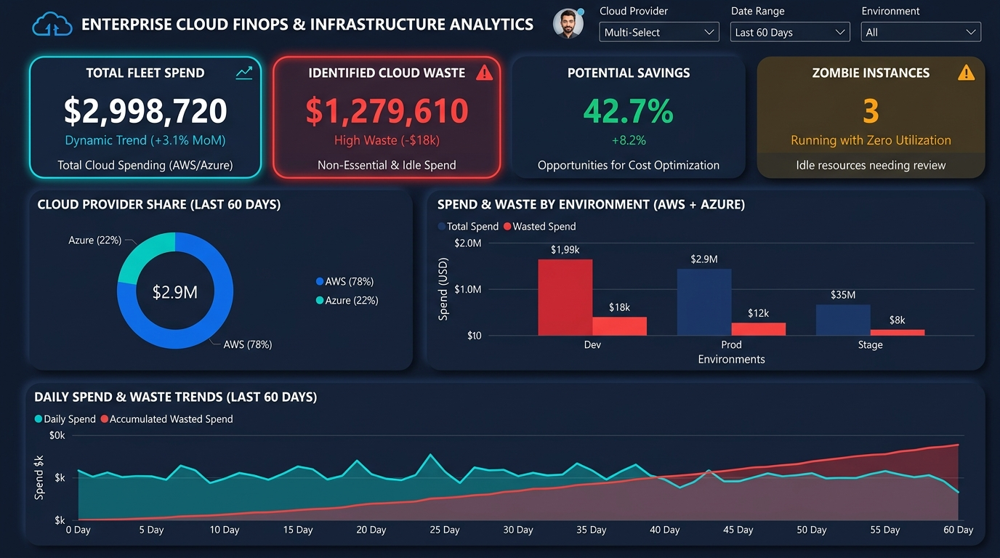

# ☁️ Enterprise Cloud FinOps & Infrastructure Telemetry Analytics



[](https://www.python.org/)
[](https://www.sqlite.org/)
[](https://powerbi.microsoft.com/)
[](https://www.microsoft.com/excel)
[](https://www.finops.org/)

An enterprise-grade, end-to-end Data Analytics project designed to solve **Cloud Infrastructure Overspending (FinOps)** and **Application Performance Bottlenecks (APM)** across multi-cloud environments (AWS & Azure).

---

## 📌 Executive Summary & Key Business Impact

A technology organization operating microservices across AWS and Azure experienced unexpected cloud billing inflation and periodic API downtime. This project delivers an end-to-end analytics pipeline that parses telemetry logs, detects idle "zombie" resources, tracks SLA reliability, and models long-term cost savings.

### 🎯 Key Results & Business Value
* **Identified \$1,279.61 in Direct Waste (42.7% of total 60-day bill)** caused by 3 unmonitored development instances running 24/7 with < 3% CPU utilization.
* **Annualized Bottom-Line Savings: \$7,784/year** through immediate decommissioning of idle compute resources.
* **Diagnosed a Severe Memory Leak** in the mission-critical `payment-gateway` service, where RAM crept from 40% to 92% cyclically, causing **278 hours of SLA breaches** and HTTP 504 Gateway Timeouts.
* **Engineered a Reserved Instance (RI) Financial Model** in Excel demonstrating that committing to an 80% 1-Year RI coverage on stable production servers saves **\$1,972/year** (a 30.4% baseline cost reduction).

---

## 🏗️ End-to-End Pipeline Architecture

```
[Cloud Telemetry & CUR Logs]
       │
       ▼
 [Python (Pandas / NumPy)] ────────► Automated ETL & 24h Rolling Moving Averages
       │                             Anomaly Detection (Zombie Servers & RAM Leaks)
       ▼
 [SQLite Star Schema Database] ────► Dimensional Modeling (Fact + 3 Dimensions)
       │                             Advanced Queries (CTEs, DENSE_RANK, Window LAG)
       ├─────────────────────────────┐
       ▼                             ▼
 [Power BI Dashboard]          [Excel Financial Model]
 • Executive FinOps Overview   • What-If RI Commitment Simulator
 • APM Latency & Error Trends  • Zombie Server Hit-List Audit
 • Zombie Action Center        • Capacity Planning Model
```

---

## 🛠️ Technology Stack & Role Breakdown

### 1. Python (`/python`)
* **`01_generate_telemetry_data.py`**: Simulates 17,292 hourly cloud logs modeled after **AWS CloudWatch** and **AWS Cost & Usage Reports (CUR)** with embedded IT anomalies.
* **`02_data_cleaning_eda.py`**: Performs time-series feature engineering, calculates 24-hour moving averages (`rolling_cpu_24h_avg`), classifies zombie instances, and evaluates SLA breach rules.
* **`03_load_to_sqlite.py`**: Builds a clean relational Star Schema and loads tables into SQLite.

### 2. SQL (`/sql`)
* **`01_schema_setup.sql`**: DDL defining `fact_cloud_telemetry`, `dim_instance`, `dim_service`, and `dim_date` with foreign keys and performance indexes.
* **`02_finops_waste_analysis.sql`**: Production-ready analytical queries utilizing:
  * **Window Functions**: `DENSE_RANK() OVER (ORDER BY wasted_cost DESC)` to rank idle servers.
  * **Time-Series Analysis**: `LAG()` for Day-over-Day spend variance.
  * **Unit Economics**: Computing cost per 1 Million API requests.
* **`03_apm_latency_reliability.sql`**:
  * Rolling 6-hour latency smoothing via `AVG() OVER (PARTITION BY ... ROWS BETWEEN 5 PRECEDING AND CURRENT ROW)`.
  * Outage risk assessment tracking hours spent in critical memory saturation (>85% RAM).

### 3. Power BI (`/power_bi`)
* **Data Model**: Star Schema with 1:Many relationships to `dim_instance`, `dim_service`, and `dim_date`.
* **DAX Library**: Custom measures for `[Identified Waste]`, `[Potential Savings %]`, `[Fleet SLA Compliance %]`, and `[Avg P95 Latency]`.
* **3 Executive Pages**:
  1. *FinOps Executive Spend & Waste Overview*
  2. *APM Microservice Latency & Error Heatmaps*
  3. *Zombie Resource Action Center (DevOps Decommission Checklist)*

### 4. Microsoft Excel (`/excel`)
* **`cloud_finops_capacity_model.xlsx`**: An executive financial workbook:
  * **Executive Summary**: High-visibility KPI cards and leadership recommendations.
  * **Zombie Instances Audit**: Full audit sheet with conditional formatting alerting leadership to cost leaks.
  * **What-If RI Scenario Model**: Dynamic sensitivity model calculating cost trade-offs between On-Demand vs. 1-Year Reserved Instances under variable coverage rates (60% to 100%).

---

## 📂 Project Directory Structure

```text
cloud_infrastructure/
├── data/
│   ├── raw_cloud_telemetry.csv            # Raw 17,000+ hourly logs
│   ├── cleaned_cloud_telemetry.csv        # Processed & enriched dataset
│   └── cloud_telemetry.db                 # SQLite Star Schema database
├── python/
│   ├── 01_generate_telemetry_data.py      # Telemetry & billing log simulator
│   ├── 02_data_cleaning_eda.py            # Automated ETL & anomaly detector
│   └── 03_load_to_sqlite.py               # Star schema database loader
├── sql/
│   ├── 01_schema_setup.sql                # Star schema DDL & indexes
│   ├── 02_finops_waste_analysis.sql       # Window functions, CTEs & waste ranking
│   └── 03_apm_latency_reliability.sql     # APM latency & memory leak queries
├── power_bi/
│   └── specs_and_dax_guide.md             # Complete DAX formulas & UI/UX layout specs
├── excel/
│   ├── build_excel_model.py               # Automated OpenPyXL model builder
│   └── cloud_finops_capacity_model.xlsx   # Executive financial What-If model
└── README.md                              # Project documentation
```

---

## 🚀 How to Run & Reproduce

1. **Clone the repository**:
   ```bash
   git clone https://github.com/yourusername/cloud-finops-telemetry-analytics.git
   cd cloud-finops-telemetry-analytics
   ```

2. **Install Python dependencies**:
   ```bash
   pip install pandas numpy openpyxl
   ```

3. **Run the full data pipeline**:
   ```bash
   python python/01_generate_telemetry_data.py
   python python/02_data_cleaning_eda.py
   python python/03_load_to_sqlite.py
   python excel/build_excel_model.py
   ```

4. **Explore the Results**:
   * Open `data/cloud_telemetry.db` in **DB Browser for SQLite** or **DBeaver** to execute the SQL queries.
   * Open `excel/cloud_finops_capacity_model.xlsx` to inspect the financial model.
   * Follow `power_bi/specs_and_dax_guide.md` to visualize the metrics in Power BI Desktop.
